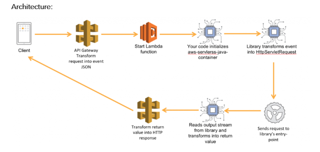

# aws-serverless-jersey
Serverless Java Container makes it easy to take an application written in Java with frameworks such as Spring, Spring Boot, Jersey, or Spark and run it inside AWS Lambda with minimal code changes.
The Serverless Java Container library acts as a proxy between the Lambda runtime and the framework of your choice, pretends to be a servlet engine, translates incoming events to request objects that frameworks can understand, and transforms responses from your application into a format that API Gateway understands.

Pre requisites
•	Apache Maven 3.6.3(Any version)
•	Eclipse Neon
•	java version "1.8.0_231" (Java 1.8 any version)
•	AWSCLI64PY3 (Windows) installed and AWS keys and region should be configured

This Architectures primarily focuses on building working model  based on Jersey api, create a Maven project and add dependency in the pom.xml

Once dependency is downloaded, we can start to build the api
Resource class is the entry point for the rest application, this class primarily hold the http request such as GET, POST

The Lambda handler Class
First, we declare a static ResourceConfig, Jersey’s Application implementation, object. We configure this object to scan our resource package for annotated classes and load the JacksonFeature class to handle JSON content types.
Next, we declare a second static instance of the JerseyLambdaContainerHandler object. We initialize this object using the getAwsProxyHandler static method with our ResourceConfig object. The getAwsProxyHandler method automatically creates an instance of our library configured to handle API Gateway’s proxy integration events. You can create custom implementations of the RequestReader and ResponseWriter objects to support custom event types.
You will notice that both these variables are declared as static class members. They are class members because we only need a single instance of these objects. AWS Lambda tries to re-use containers across invocations. Our handler class is held by the runtime as a singleton and the handleRequest method is invoked each time. We can re-use both the ResourceConfig and JerseyLambdaContainerHandler. Static variables are instantiated by the Java runtime as Lambda starts it; this gives us better performance for the heavy introspection operations.

Deploying the Application
The sam.yaml file is a Serverless Application Model (SAM) template we can use to deploy our application to AWS 
You can use the AWS CLI to quickly deploy your application to AWS Lambda and Amazon API Gateway.
You will need an S3 bucket to store the artifacts for deployment. Once you have created the S3 bucket, run the following command from the project’s root folder – where the sam.yaml file is located

CLI Commands

aws cloudformation package --template-file sam.yaml --output-template-file output-sam.yaml --s3-bucket bucketcm25

As the command output suggests, you can now use the cli to deploy the application. Choose a stack name and run the aws cloudformation deploy command from the output of the package command.

aws cloudformation deploy --template-file output-sam.yaml --stack-name ServerlessJerseyApi --capabilities CAPABILITY_IAM

Once the application is deployed, you can describe the stack to show the API endpoint that was created.
aws cloudformation describe-stacks --stack-name ServerlessJerseyApi

Conclusion
Serverless Java Container makes it easy to create scalable APIs with the Java framework of your choice. In this blog post we used Jersey, the library also offers archetypes for Spring, Spring Boot, and Spark. Projects created using the archetypes come pre-packaged with a working Lambda handler
